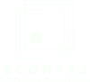

<h1 align="center">
    
    
<p>
  

  
  
  <a href="https://github.com/anamaximiano93/econtas-controle-financeiro-app/commits/master">
    
  </a>   
   

   <a href="https://github.com/anamaximiano93/econtas-controle-financeiro-app/issues">
    
  </a>
  
 
</p>
</h1>

Econtas app de controle financeiro, projeto final proposto no bootcamp FullStack IGTI 2020. App contem funcionalidade de adicionar uma nova transação como receita ou despesa, assim podendo posteriomente edita-la ou exclui-la elas estão sendo paginadas por mês-ano.

**Layout antes da refatoração.**

<div>


</div>

**Layout depois da refatoração.**

<div>
<!--  gif -->


</div>

<br>

### 🎯Features

- [x] Registro de usuário
- [x] Autenticação de usuario com JWT + Login
- [x] Email para recuperação de senha
- [x] Redefinição de senha
- [x] Redefinição do layout
- [x] Criação de rotas
- [x] Criação de pagina de gráficos
- [ ] Login social
- [ ] Avatar no perfil do usuario
- [ ] Uso de Logger

<br>

## ⚡Pré-requisitos

Antes de começar, você vai precisar ter instalado em sua máquina as seguintes ferramentas: [Git](https://git-scm.com), [Node.js](https://nodejs.org/en/). Além disso é bom ter um editor para trabalhar com o código como [VSCode](https://code.visualstudio.com/).

- obs: Foi utilizado o [Yarn](https://yarnpkg.com/) como instalador de dependências.

<br>

## 🚀 Como executar o projeto

### 🎲 Clonando o Projeto e Instalando as Dependências:

```bash
# Clone este repositório
$ git clone https://github.com/anamaximiano93/econtas-controle-financeiro-app.git

# Acesse a pasta do projeto no terminal/cmd (ps: nome da pasta)
$ cd econtas-controle-financeiro-app

# Instalando dependências do Back-End (raiz da pasta)
# npm ou yarn + install
$ yarn install

# Instalando dependências do Front-End (pasta client)
$ cd client
# npm ou yarn + install
$ yarn install

```

### 🎲 Executando o Projeto:

```bash
# Executando Back-End do projeto (raiz da pasta)
# npm start ou yarn server
$ yarn server

# Executando Front-End do projeto (pasta client)
$ cd client
# npm start ou yarn start
$ yarn start

```

## 🛠 Tecnologias

### As seguintes ferramentas, frameworks foram usadas na construção do projeto:

- [Node.js](https://nodejs.org/en/)
- [Express](https://expressjs.com/pt-br/)
- [Axios](https://github.com/axios/axios)
- [Bcryptjs](https://www.npmjs.com/package/bcryptjs)
- [JsonWebToken](https://www.npmjs.com/package/jsonwebtoken)
- [Mongodb](https://www.mongodb.com/pt-br)
- [Mongoose](https://mongoosejs.com/)
- [Nodemailer](https://nodemailer.com/)
- [Materialize-css](https://materializecss.com/)
- [jwt-decode](https://www.npmjs.com/package/jwt-decode)
- [Apexcharts](https://apexcharts.com/)
- [Chroma-js](https://www.npmjs.com/package/chroma-js)
- [React](https://pt-br.reactjs.org/)
- [React-Router](https://reactrouter.com/web/guides/quick-start)
- [React-modal](https://github.com/reactjs/react-modal/)
- [React-apexcharts](https://apexcharts.com/docs/react-charts/)
- [React-select](https://react-select.com/home)
- [React-toastify](https://fkhadra.github.io/react-toastify/introduction)

<br>

<div align="center">

<a href="https://econtas-desafio-final-3001.herokuapp.com/" target="_blank">


</a>

</div>

---

<p align="center">
Feito com ❤️ por Ana Maximiano 👋🏽 Entre em contato!
</p>
